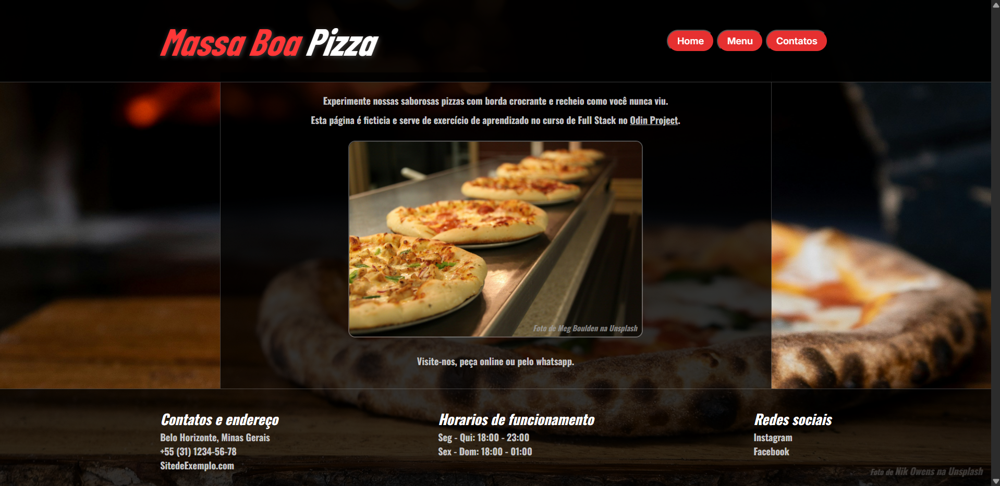
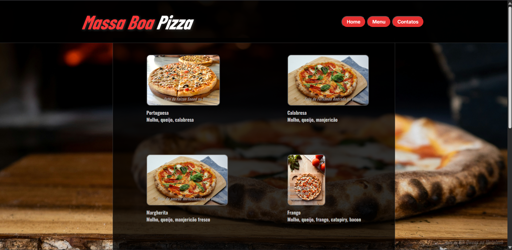
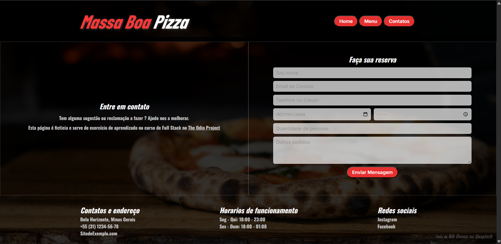

# 🍕 Massa Boa Pizza — Restaurant Page





## 📋 Sobre o Projeto

Página de restaurante fictício desenvolvida como exercício do curso **Full Stack JavaScript** do [The Odin Project](https://www.theodinproject.com).

O objetivo principal foi praticar a manipulação do DOM com JavaScript puro, criando uma **Single Page Application (SPA)** onde todo o conteúdo é gerado dinamicamente via JS — sem recarregar a página.

---

## 🎯 Objetivos de Aprendizado

- Configuração e uso do **Webpack** como module bundler
- Organização de código com **ES Modules** (`import`/`export`)
- Manipulação do DOM com **JavaScript puro** (`createElement`, `appendChild`, `classList`)
- Navegação entre abas sem recarregar a página
- Estilização com **CSS** separado do JavaScript
- Deploy no **GitHub Pages** via branch `gh-pages`
- **Responsividade** com Media Queries para mobile e tablet

---

## 🚀 Tecnologias Utilizadas

- HTML5
- CSS3 (Flexbox, Grid, Media Queries)
- JavaScript ES6+ (Módulos, Arrow Functions, forEach)
- Webpack 5
- Google Fonts (Barlow Condensed, Oswald, Inter)

---

## 📱 Funcionalidades

- **Home** — apresentação do restaurante com imagem e texto
- **Menu** — cardápio com 8 pizzas em grid responsivo
- **Contatos** — formulário de reserva com campos de texto, data, horário e mais
- **Footer** — informações de contato, horários e redes sociais
- **Responsivo** — layout adaptado para mobile e desktop

---

## ⚙️ Como Rodar Localmente

```bash
# Clone o repositório
git clone https://github.com/thiagoSantz/Webpack-Restaurante.git

# Entre na pasta
cd Webpack-Restaurante

# Instale as dependências
npm install

# Rode o servidor de desenvolvimento
npx webpack serve
```

Acesse `http://localhost:8080` no navegador.

---

## 📦 Build para Produção

```bash
npx webpack
```

Os arquivos gerados ficam na pasta `dist/`.

---

## 🌐 Deploy

O projeto está disponível em:
**[https://thiagoSantz.github.io/Webpack-Restaurante/](https://thiagoSantz.github.io/Webpack-Restaurante/)**

---

## 📸 Créditos das Imagens

Todas as imagens utilizadas são do [Unsplash](https://unsplash.com) e seus respectivos fotógrafos:

- **Fundo** — Nik Owens
- **Home** — Meg Boulden
- **Menu** — Faizan Saeed, Fernando Andrade, amirali mirhashemian, Saahil Khatkhate, Artem Mihailov, Luke Oslizlo, P S, Laure Noverraz

---

## 👨‍💻 Autor

Desenvolvido por **Thiago Santz** como parte do currículo do [The Odin Project](https://www.theodinproject.com).
